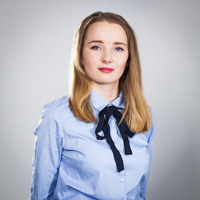
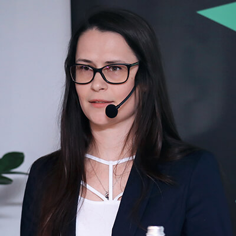
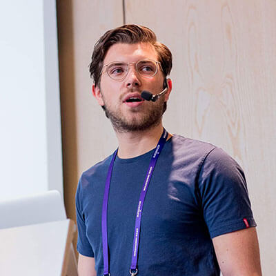

class: slide-background-purple

Opening slides...

---

background-image: url(images/Facebook_1920x1080px.jpg)
background-size: contain

---

class: center, middle, slide-invert-colors

# Highlights 2018

<iframe width="560" height="315" src="https://www.youtube-nocookie.com/embed/Q9HgpSkqHZo" frameborder="0" allow="autoplay; encrypted-media" allowfullscreen></iframe>

---

class: middle
background-image: url(images/blank.png)
background-size: contain

# Wi-Fi

## SSID: `ConFrontJS-guest`

---

class: slide-blank
background-image: url(images/blank.png)
background-size: contain

# Safety Rules

.py-3.text-center[

<iframe width="560" height="315" src="https://www.youtube-nocookie.com/embed/JFjnNdJKwxY" frameborder="0" allow="autoplay; encrypted-media" allowfullscreen></iframe>
]

---

class: slide-blank
background-image: url(images/blank.png)
background-size: contain

# Venue

.text-center.py-5[

]

---

exclude: true

### Film: intro

---

class: hosts, center, middle, slide-card-list, slide-card-list-rounded
background-image: url(images/blank.png)
background-size: contain

# Organizers

.card[ Piotr Kowalski]
.card[ Katarzyna Grabowska]
.card[ Piotr Zientara]

---

class: center, middle
background-image: url(images/blank.png)
background-size: contain

# .slim[Why] ConFrontJS.slim[?]

---

class: speakers, slide-grid, slide-grid-6-columns, slide-blank
background-image: url(images/blank.png)
background-size: contain

# Speakers

.grid-board[

]

---

class: sponsors, slide-grid, slide-grid-4-columns, slide-blank
background-image: url(images/blank.png)
background-size: contain

# Sponsors

.grid-board[

]

---

class: partners, slide-grid, slide-grid-10-columns, slide-blank
background-image: url(images/blank.png)
background-size: contain

# Partners

.grid-board[

]

---

class: volunteers, slide-grid, slide-grid-7-columns, slide-blank
background-image: url(images/blank.png)
background-size: contain

# Volunteers

.grid-board[

]

---

class: middle, slide-invert-colors
background-image: url(images/mc/barry.jpg)

# Barry Solone

## <i>Master of Ceremony</i>

---

class: slide-blank, agenda
background-image: url(images/blank.png)
background-size: contain

# Agenda (part 1)

* .ignore[08:00 — Registration]
* .ignore[09:30 — Opening by MC]
* 09:45 — .tag3[40min] Tomasz Łakomy — Sleeping better at night
* 10:25 — .tag[30min] Eleftheria Batsou — When you think there is not time for learning or coding
* .ignore[10:55 — Coffee Break]
* 11:10 — .tag[30min] Tetiana Platonova — The Importance of Clean Code
* 11:50 — .tag[30min] Jerbi Saif — Mastering Reactive Programming with RxJS
* .ignore[12:20 — Lunch]

---

class: slide-blank, agenda
background-image: url(images/blank.png)
background-size: contain

# Agenda (part 2)

* 13:10 — .tag[30min] Przemysław Zych — Should I fire my DevOps already? <!--Build your infrastructure using TypeScript-->
* 13:40 — .tag[30min] Wojciech Jureczka — How to change mindset of coworkers?
* .ignore[14:10 — Activity Break]
* 14:25 — .tag[30min] Piotr Tomiak — How to help your editor love your Vue component library
* 14:55 — .tag[30min] Andrzej Mazur — The past, present, and the future of HTML5 game dev
* .ignore[15:25 — Sponsors Break]

---

class: slide-blank, agenda
background-image: url(images/blank.png)
background-size: contain

# Agenda (part 3)

* 15:40 — .tag2[5min] Bonus Lightning Talk
* 15:45 — .tag2[5min] Yonatan Kra — How close is your data?
* 15:50 — .tag2[5min] Elad Shechter — Mobile First? Desktop First? <!--Basic First - A New Approach for Responsive Design-->
* 15:55 — .tag2[5min] Yonatan Doron — Microinteractions: Little Things That Matter
* 16:00 — .tag2[5min] Nadia Ginalska — The sweet allure of a full rewrite
* 16:05 — .tag2[5min] Jan Salwowski — Tips for maintainable Vue code
* 16:10 — .tag2[5min] Tymon Terlikiewicz — Lessons learned migrating from a monolith frontend

---

class: slide-blank, agenda
background-image: url(images/blank.png)
background-size: contain

# Agenda (part 4)

* 16:15 — .tag[30min] Roy Derks — Web applications of the future with TypeScript and GraphQL
* 16:45 — .tag3[40min] Chris Heilmann — Into the web multiverse
* .ignore[17:25 — Final (Contest’s winner announcement)]
* .ignore[17:30 — After Party]

---

class: slide-blank
background-image: url(images/blank.png)
background-size: contain

# Question

.size80[

## Who was on the previous of .bold[ConFrontJS]?

]

## Hands up! 🤚

---

class: slide-blank
background-image: url(images/blank.png)
background-size: contain

# Catering & Lunch

.text-center[

]

---

class: slide-blank
background-image: url(images/blank.png)
background-size: contain

# Contests

.size40[

* Stand **WarsawJS** in the holl
    + Best picture with hashtag _#confrontjs_
    + Free tickets for MasterClass
* Sponsors
    + Especially **Venue Sponsor**

]

---

class: middle
background-image: url(images/blank.png)
background-size: contain

# Berlin Code of Conduct

## [berlincodeofconduct.org](https://berlincodeofconduct.org/)

---

exclude: true
class: middle
background-image: url(images/blank.png)
background-size: contain

# Newsletter

## [newsletter.warsawjs.com](https://newsletter.warsawjs.com/)

---

class: middle
background-image: url(images/blank.png)
background-size: contain

# Thanks!

## Have a great <strike>confrontations</strike> conversations!

---

class: slide-background-purple

Closing slides...

---

class: slide-blank
background-image: url(images/blank.png)
background-size: contain

# Survey

.text-center[

#  [bit.ly/confrontjs-2019](http://bit.ly/confrontjs-2019)

]

---

class: middle
background-image: url(images/blank.png)
background-size: contain

# Contest’s Winner Announcement 🎁

---

class: middle
background-image: url(images/blank.png)
background-size: contain

.size80[

## Call For Papers on .bold[ConFrontJS 2020] just begins!

]

---

class: slide-blank
background-image: url(images/blank.png)
background-size: contain

# Thanks

.size50[

* speakers
* sponsors
* volunteers
* attendees

]

---

class: middle
background-image: url(images/blank.png)
background-size: contain

# Can we take a picture together?
