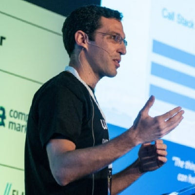
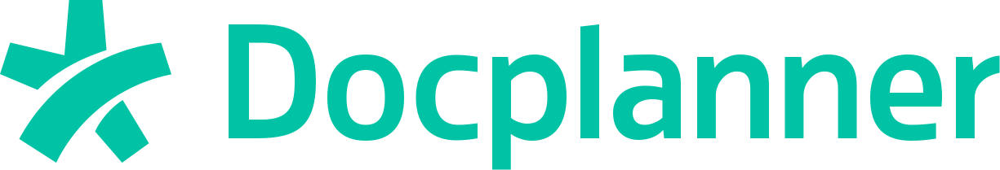
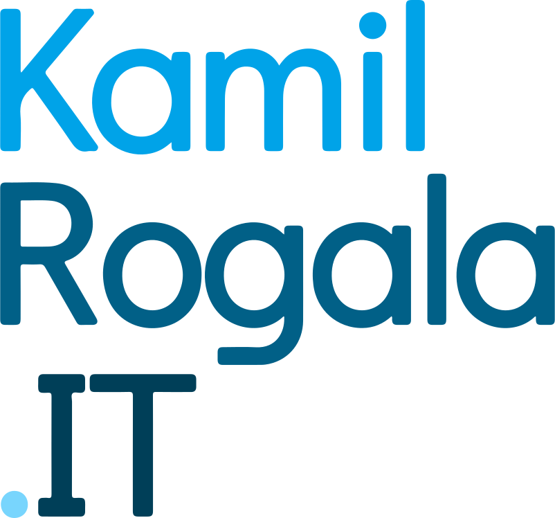
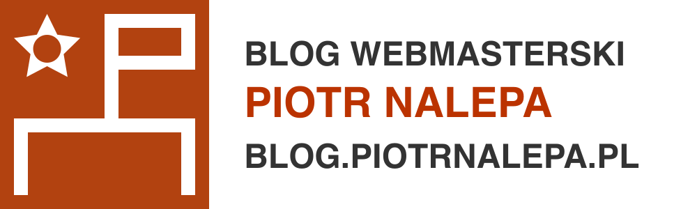

# Slajdy początkowe

---

background-image: url(images/Facebook_1920x1080px.jpg)
background-size: contain

---

class: center, middle, slide-invert-colors

# Highlights 2018

<iframe width="560" height="315" src="https://www.youtube.com/embed/6CbQMclHUSU" frameborder="0" allow="autoplay; encrypted-media" allowfullscreen></iframe>

---

class: middle
background-image: url(images/blank.png)
background-size: contain

# Wi-Fi

## SSID: `ConFrontJS-guest`

---

class: middle
background-image: url(images/blank.png)
background-size: contain

# Film: Bezpieczeństwo

TODO

---

class: center, middle
background-image: url(images/blank.png)
background-size: contain

# Welcome Venue Sponsor

---

exclude: true

### Film: intro

---

class: hosts, center, middle, slide-card-list, slide-card-list-rounded
background-image: url(images/blank.png)
background-size: contain

# Organizers

.card[ Piotr Kowalski]
.card[ Katarzyna Grabowska]
.card[ Piotr Zientara]

---

class: center, middle
background-image: url(images/blank.png)
background-size: contain

# .slim[Why] ConFrontJS.slim[?]

---

class: speakers, slide-grid, slide-grid-6-columns, slide-blank
background-image: url(images/blank.png)
background-size: contain

# Speakers

.grid-board[

]

---

class: sponsors, slide-grid, slide-grid-4-columns, slide-blank
background-image: url(images/blank.png)
background-size: contain

# Sponsors

.grid-board[

]

---

class: partners, slide-grid, slide-grid-10-columns, slide-blank
background-image: url(images/blank.png)
background-size: contain

# Partners

.grid-board[

]

---

class: volunteers, slide-grid, slide-grid-7-columns, slide-blank
background-image: url(images/blank.png)
background-size: contain

# Volunteers

.grid-board[

]

---

class: middle, slide-invert-colors
background-image: url(images/mc/barry.jpg)

# Barry Solone

## <i>Master of Ceremony</i>

---

class: volunteers, slide-grid, slide-grid-7-columns, slide-blank
background-image: url(images/blank.png)
background-size: contain

# Agenda

TODO

---

class: slide-blank
background-image: url(images/blank.png)
background-size: contain

# Question

# Who was on the previous ConFrontJS?

## Hands up! 🤚

---

class: middle
background-image: url(images/blank.png)
background-size: contain

# Survey

## [bit.ly/confrontjs-2019](http://bit.ly/confrontjs-2019)

---

class: slide-blank
background-image: url(images/blank.png)
background-size: contain

# Venue

.text-center[

]

---

class: slide-blank
background-image: url(images/blank.png)
background-size: contain

# Catering & Lunch

.text-center[

]

---

class: slide-blank
background-image: url(images/blank.png)
background-size: contain

# Contests

.size40[

* Stand **WarsawJS** in the holl
    + Best picture with hashtag _#confrontjs_
    + Free tickets for MasterClass
* Sponsors
    + Especially **Venue Sponsor**

]

---

class: middle
background-image: url(images/blank.png)
background-size: contain

# Berlin Code of Conduct

## [berlincodeofconduct.org](https://berlincodeofconduct.org/)

---

### Newsletter

class: middle
background-image: url(images/blank.png)
background-size: contain

## [newsletter.warsawjs.com](https://newsletter.warsawjs.com/)

---

### Informacja, że na końcu będzie robili wspólne zdjęcie! 📸

---

Let's do this!

---

class: middle
background-image: url(images/blank.png)
background-size: contain

# Thanks!

## Have a great <strike>confrontations</strike> conversations!

---

Slajdy końcowe:

---

### Ankieta

### Losowanie nagród

### Uruchomienie Call For Papers na kolejną edycję

### Podziękowanie prelegentom

### Podziękowanie sponsorom

### Podziękowanie wolontariuszom

### Wspólne zdjęcie
